

  <picture>
    <source media="(prefers-color-scheme: dark)" srcset="docs/brand/halation-logo-on-dark.svg">
    
  </picture>

<h3 align="center">High-quality multimedia tools. One local workspace.</h3>

<a href="https://github.com/Sylphera/Halation/releases/tag/v1.0.2">Halation 1.0.2 · v1.0.2</a>

Create, process, enhance and export images, video and audio with fast, focused tools that work independently or together.

Local by default. No account, no cloud, no watermark.

<a href="https://github.com/Sylphera/Halation/releases/latest"><b>Download for Windows</b></a> &nbsp;·&nbsp; Windows 10 and 11 &nbsp;·&nbsp; Freeware

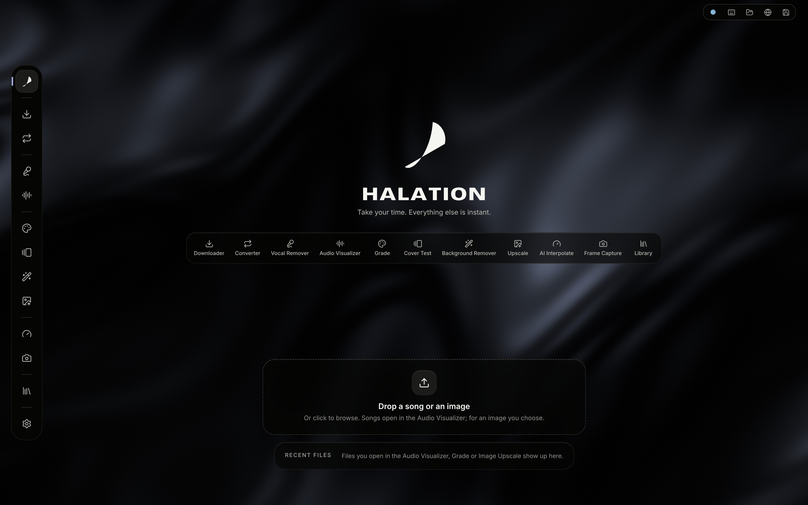

## Why Halation

Halation brings focused image, video and audio tools into one desktop workspace. Make a quick edit, prepare an export, or combine tools for a larger project, with your files and results close at hand.

- **Modular by design.** Every tool works fully on its own. There is no required workflow: use Halation as a complete workspace or open just one tool. *Send to…* connects tools when it helps.
- **Local by default.** Processing runs on your PC, without an account, cloud processing or watermarks.
- **Install only what you need.** Heavy processing engines and AI models are optional, independent components, installed separately only when a function needs them.

## The tools

<table>
<tr>
<td width="50%" valign="top">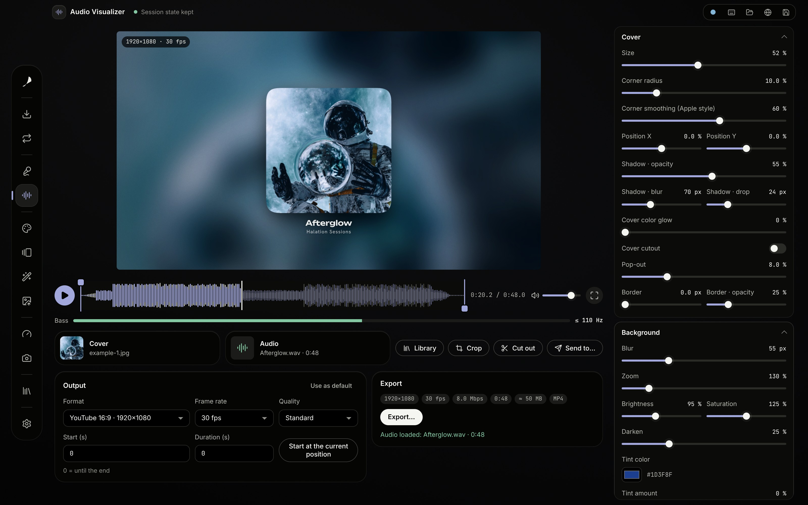 <b>Audio Visualizer</b> Turn audio and an image into an audio-reactive video.</td>
<td width="50%" valign="top">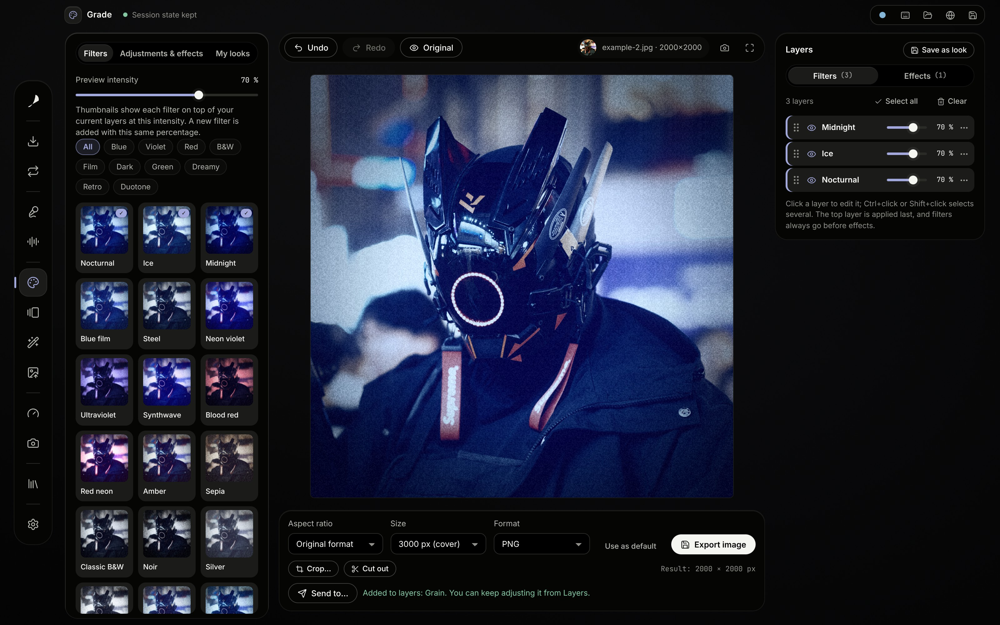 <b>Grade</b> Looks, effects and text layers for images.</td>
</tr>
<tr>
<td width="50%" valign="top">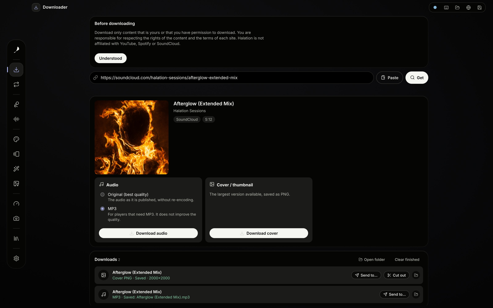 <b>Downloader</b> Download video, audio or artwork from a link.</td>
<td width="50%" valign="top">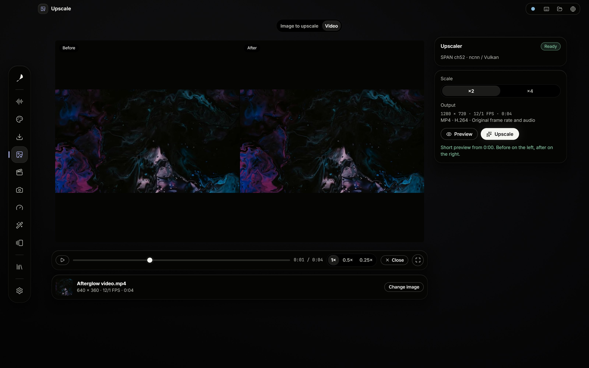 <b>Upscale</b> AI image and video upscaling at ×2 or ×4.</td>
</tr>
<tr>
<td width="50%" valign="top">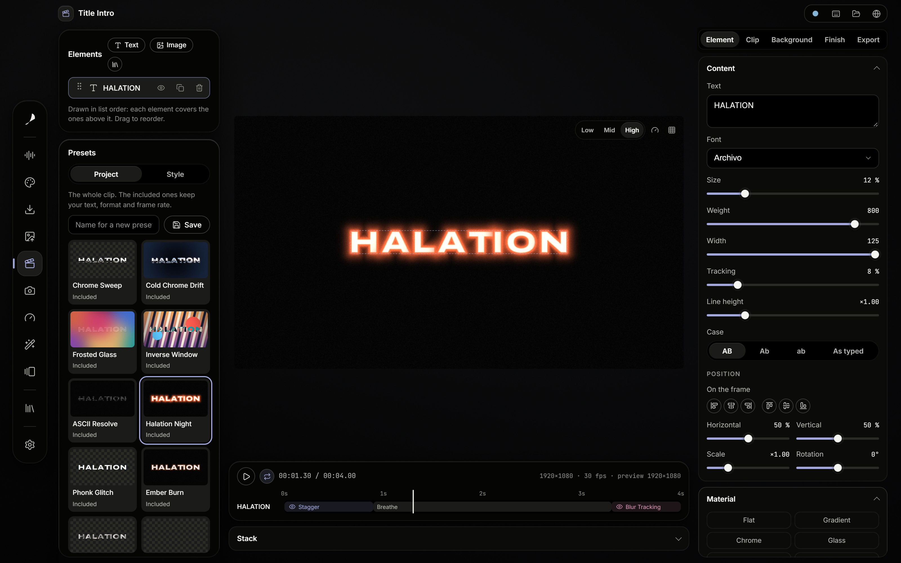 <b>Title Intro</b> Animated titles with transparency, ready for your editor.</td>
<td width="50%" valign="top">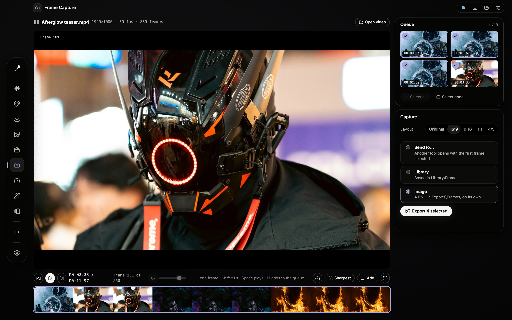 <b>Frame Capture</b> Exact frames from video, with the best of each scene suggested.</td>
</tr>
<tr>
<td width="50%" valign="top">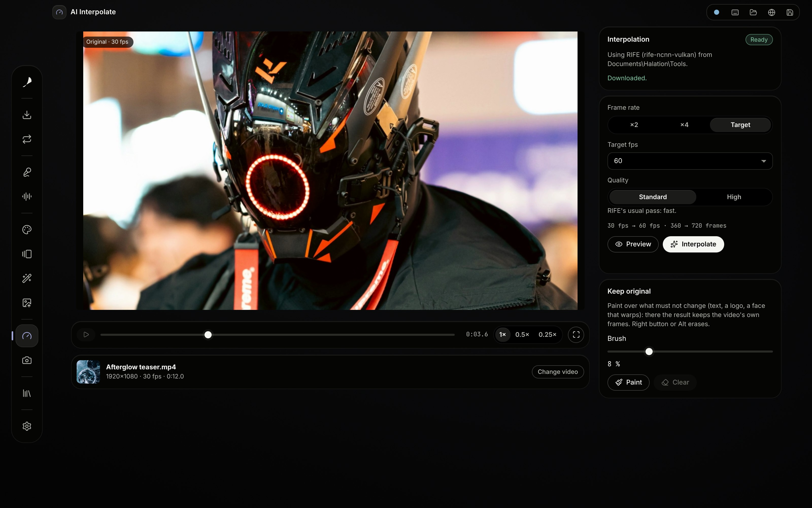 <b>AI Interpolate</b> Smoother motion: ×2, ×4 or up to 144 fps.</td>
<td width="50%" valign="top">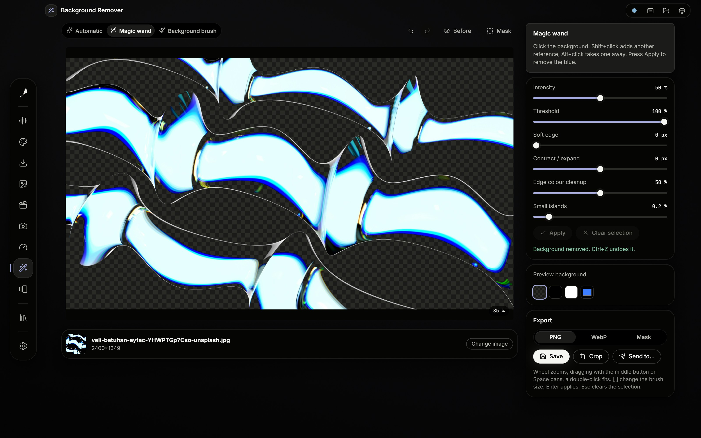 <b>Background Remover</b> Cut out a subject automatically or by hand.</td>
</tr>
<tr>
<td width="50%" valign="top">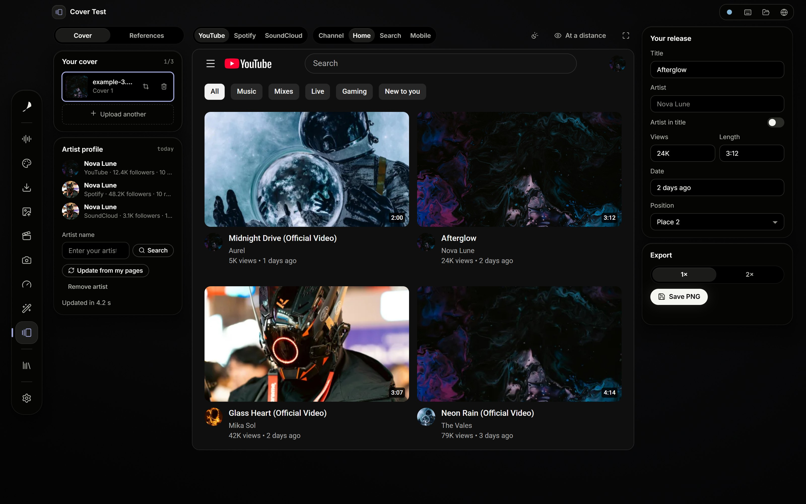 <b>Cover Test</b> Preview artwork in YouTube, Spotify and SoundCloud layouts.</td>
<td width="50%" valign="top">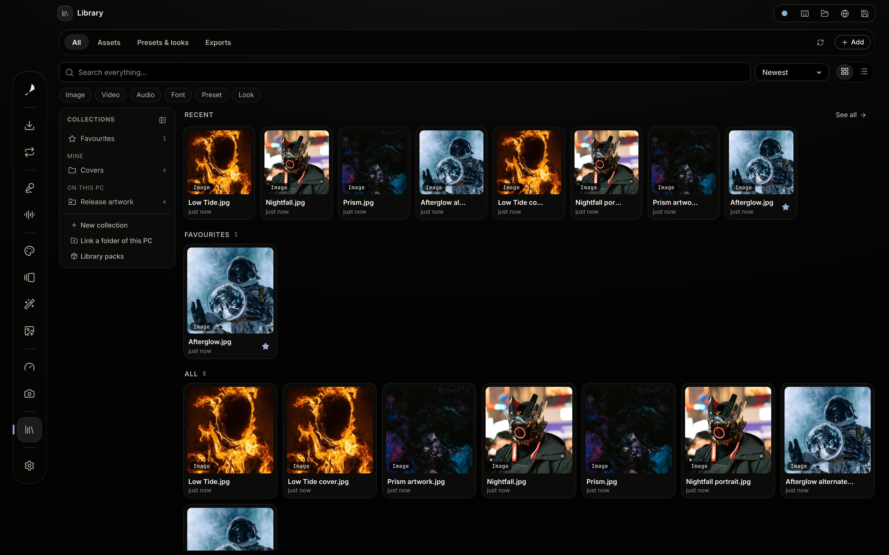 <b>Library</b> Keep exports, favourites and linked folders together.</td>
</tr>
</table>

Example photos by Alex Shuper, Fukuro, Paweł Czerwiński, Vladimir Fedotov and Veli Batuhan Aytaç on Unsplash.

## In detail

### Tools

- **Audio Visualizer**: audio and an image become an audio-reactive MP4 (H.264 or VP9, AAC or Opus, on the GPU when available) for YouTube, Shorts, square and more. Waveform with draggable clip markers, export queue.
- **Grade**: 38 filters plus adjustments, optical and texture effects and text layers, in two layer tabs with drag to reorder and multi-select. Exports at the original resolution or preset sizes up to 3000 px, also in batches.
- **Title Intro**: animated titles, intros and watermarks with transparency (ProRes 4444, WebM VP9, PNG sequence) to place over a video in CapCut, DaVinci Resolve or Premiere. 8 materials, entrance / hold / exit animations on a timeline, 10 included presets and your own.
- **Frame Capture**: exact frames of a video at full resolution, the sharpest frame of each scene suggested, a queue of frames, and a round trip with Grade, the Audio Visualizer and the Library.
- **AI Interpolate**: a video's frame rate ×2, ×4 or up to a target (30 to 144 fps) with RIFE, a before / after preview side by side, and an H.264 MP4 with the original audio.
- **Background Remover**: Automatic (the Cutout model), Magic wand and Background brush, with soft edge, contract / expand and edge colour cleanup; PNG, WebP or the mask.
- **Upscale**: images at ×2 or ×4 with Photo, Digital art / cover, Sharp or Fast models and a zoomable Before/After view. Video uses SPAN ch52 via ncnn/Vulkan at ×2 or ×4, preserving aspect ratio and source FPS. SDR constant-frame-rate video exports as H.264 MP4 with source audio (copy or AAC). Short temporal Before/After previews; progress and cancellation through Jobs.
- **Downloader**: the video, the audio or the largest cover of a link (Spotify song links are matched on YouTube and tagged with Spotify's metadata), with a queue.
- **Cover Test**: preview release artwork in YouTube, Spotify and SoundCloud layouts, including feeds, artist profiles and release views. Compare with reference artists, edit fictional titles and other metadata to try out a release, and export the preview as PNG at ×1 or ×2. Screenshots here use synthetic artists and fixture data.
- **Library**: your own sections, linked PC folders, favourites and tags, with exports and downloads from the tools collected together. Optional packs add grain, paper, light leaks, shapes and frames; Library items can be opened in other tools.

### Across the workspace

- **Cutout and Crop**: shared editing tools for removing backgrounds and framing images.
- **Send to…**: pass a result to another tool when you want to continue working on it.
- **Home**: open tools from their shortcuts, reopen recent files, or use one drop zone for everything. Keyboard shortcuts are available with `?`.
- **Files and settings**: presets, looks, projects, exports and settings are plain files in `Documents\Halation`. English interface, with Spanish translations where available.

## Install

The current stable release is [Halation 1.0.2](https://github.com/Sylphera/Halation/releases/tag/v1.0.2). Download it from the release page, or get the [latest stable release](https://github.com/Sylphera/Halation/releases/latest):

- `Halation_<version>_x64-setup.exe` installs for the current user, without administrator rights. Running a newer setup over an installed version updates it in place and keeps your presets, settings and shortcuts.
- `Halation_<version>_x64-portable.exe` runs without installing.

Windows 10 or 11 with WebView2. No account or cloud service is required. The builds are currently not code-signed, so SmartScreen may warn on first launch: **More info → Run anyway**.

Some tools need optional components, downloaded on demand to `Documents\Halation\Tools` or managed from **Settings → Modules**. They are separate from the installer:

- **yt-dlp** for downloads and **FFmpeg** for media conversion and video processing.
- **upscayl-bin and the Upscayl models** for image upscaling; an existing [Upscayl](https://upscayl.org) installation can also be used.
- **SPAN ch52 models and the ncnn/Vulkan runner** for Video Upscale.
- **The Cutout model** for automatic background removal.
- **RIFE** for AI Interpolate.

Image and video upscaling require a Vulkan-capable GPU. AI Interpolate uses Vulkan when available and can run on the CPU.

## Legal

[Privacy](PRIVACY.md)

Halation is proprietary freeware, not open-source software. It is free to use for personal and commercial purposes under the [Halation Freeware License](LICENSE). You retain your rights in the work you create or process with Halation, and may use your outputs personally or commercially without royalties to Halation, subject to third-party rights and applicable law. The license governs use of Halation itself, including restrictions on modification and redistribution.

Use the Downloader only for content that is yours or that you have permission to download. yt-dlp, FFmpeg, Upscayl (upscayl-bin and its models), SPAN/ncnn, the Cutout model and RIFE are separate projects, downloaded separately at run time, each under its own license. Bundled fonts and libraries and the example photos are listed in [THIRD_PARTY.md](THIRD_PARTY.md); their own licenses remain unchanged.
